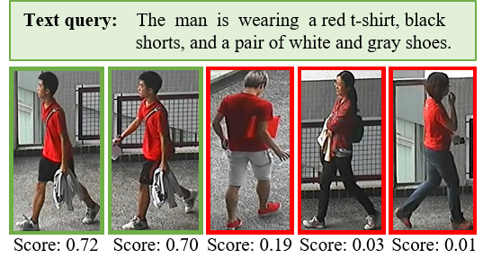

# TextReIDNet
This is the codebase for TextReIDNet (Text-based Person Re-identification Network). The details of TextReIDNet are found in our DCOSS-IoT 2024 paper titled "Resource-Efficient Text-based Person
Re-identification on Embedded Devices".

&nbsp;

# Summary
TextReIDNet is a lightweight person re-identification model designed explicitly for embedded devices. TextReIDNet has a total of 32.29 million parameters only, but a achieves an
impressive 52.76% and 35.71% top-1 accuracy on the CUHK-PEDES and RSTPReid datasets respectively.


Figure 1. The architure of TextReIDNet.

&nbsp;
## Requirements (dependencies)
- Operating System: Ubuntu 20.04.6 LTS (irrelevant but worth mentioning)
- CUDA Version: 11.7
- python version: 3.9.18
- pytorch version: 1.13.1
- torchvision version: 0.14.1
- pillow version: 9.5.0
- opencv-python version: 4.8.1.78
- tqdm version: 4.66.1
- numpy version: 1.26.2
- natsort version: 8.4.0


The remaining requirements are specified in [requirements.txt](requirements.txt)

&nbsp;
## Resources
- CUHK-PEDES dataset: please see [here](https://github.com/ShuangLI59/Person-Search-with-Natural-Language-Description)
- RSTPReid dataset: please see [here](https://github.com/NjtechCVLab/RSTPReid-Dataset)
- Pretrained model (30 epochs): [TextReIDNet_State_Dicts.pth.tar](https://drive.google.com/file/d/1Clry-_oJcQXDbA92H0ARUerlzw-9hdrI/view?usp=sharing)
- ```bpe_simple_vocab_16e6.txt.gz```: [Download](https://github.com/openai/CLIP/blob/main/clip/bpe_simple_vocab_16e6.txt.gz) 


&nbsp;
## Setup
- Install dependencies. Complete list of dependencies is in ```requirements.txt```
- Download or clone TextReIDNet repository
- Navigate into TextReIDNet directory: ```cd /path/to/TextReIDNet```
- Download the pre-trained model [TextReIDNet_State_Dicts.pth.tar](https://drive.google.com/file/d/1Clry-_oJcQXDbA92H0ARUerlzw-9hdrI/view?usp=sharing) and put it into ```TextReIDNet/data/checkpoints/TextReIDNet_State_Dicts.pth.tar```
- Download ```bpe_simple_vocab_16e6.txt.gz``` from [here](https://github.com/openai/CLIP/blob/main/clip/bpe_simple_vocab_16e6.txt.gz) and place it in ```TextReIDNet_github/data/bpe_simple_vocab_16e6.txt.gz```
- https://github.com/openai/CLIP/blob/main/clip/bpe_simple_vocab_16e6.txt.gz
- Read and modify the ```config.py``` to suit your system resources and requirements

&nbsp;
## Test (using pretrained model - 30 epochs)
- Please make sure the pre-trained model [TextReIDNet_State_Dicts.pth.tar](https://drive.google.com/file/d/1Clry-_oJcQXDbA92H0ARUerlzw-9hdrI/view?usp=sharing) is downloaded put it into ```TextReIDNet/data/checkpoints/TextReIDNet_State_Dicts.pth.tar```
- Also read and modify the ```config.py``` to suit your system parameters
- ```python test.py```. The test results are logged to the console only.

&nbsp;
## Inference on sample images
10 sample images are provided in ```TextReIDNet/data/samples/``` for inference purposes. ```boy_with_bag.jpg``` and ```girl_student.jpg``` are taken from the internet, while the remaining 8 are sampled from the CUHK-PEDES dataset. You may download and crop more single-person images from the internet and add them to ```TextReIDNet/data/samples/```.

- Please make sure the pre-trained model [TextReIDNet_State_Dicts.pth.tar](https://drive.google.com/file/d/1Clry-_oJcQXDbA92H0ARUerlzw-9hdrI/view?usp=sharing) is downloaded put it into ```TextReIDNet/data/checkpoints/TextReIDNet_State_Dicts.pth.tar```
- Also read and modify the ```config.py``` to suit your system parameters
- modify the value of ```textual_description``` in ```TextReIDNet/inference/search_person.py``` with the description of the person you would like to retrieve from ```TextReIDNet/data/samples/```.
- run ```TextReIDNet/inference/search_person.py```. The ranking results are logged to the console, while the top-1 image is saved to ```TextReIDNet/inference/retrieved_image.jpg```.



Figure 2. Example of Top-5 person search results on the CUHK-PEDES dataset.


&nbsp;
## Train (from scratch only, no resume capability)
- First read and modify the ```config.py``` to suit your system parameters
- Run ```python train.py```. The training progress and values are logged into ```TextReIDNet/data/logs/train.log```

&nbsp;
## Test and Inference on Nvidia Jetson Nano
Download and use the [Ubuntu 20.04 OS image](https://github.com/Qengineering/Jetson-Nano-Ubuntu-20-image) from [Qengineering](https://github.com/Qengineering/Jetson-Nano-Ubuntu-20-image) to setup the operating system on the Jetson Nano device. The libraries provided by the Ubuntu 20.04 OS image should be sufficient, but where neccessary [install the dependencies](requirements.txt). The OS image comes pre-installed with the following:
- OpenCV 4.8.0
- Pytorch 1.13.0
- TorchVision 0.14.0
- TensorRT 8.0.1.6


### Steps
- Follow the steps outlined [here](https://github.com/NVIDIA-AI-IOT/torch2trt) to install ```torch2trt ``` on the Nano device
- Clone ```TextReIDNet``` onto your Nano device
- Download the pre-trained model [TextReIDNet_State_Dicts.pth.tar](https://drive.google.com/file/d/1Clry-_oJcQXDbA92H0ARUerlzw-9hdrI/view?usp=sharing) put it into ```TextReIDNet/data/checkpoints/TextReIDNet_State_Dicts.pth.tar```
- Read and modify the ```TextReIDNet/config.py``` file (where neccessary)
- Execute ```TextReIDNet_github/nano/nano_import.py``` to get the run-time values on the Nano

Please note: The initial run-time of the first iteration is always significantly longer than that of subsequent iterations. This is due to the (delayed) loading of additional modules.


